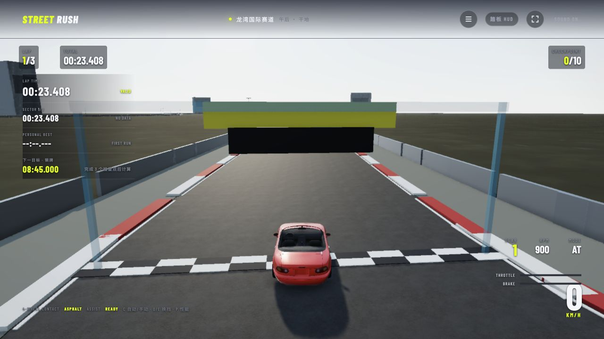

# StreetRush · 晴空环线

一个持续开发中的浏览器 3D 赛车项目。选一辆车，跑完三圈，挑战自己的最佳成绩。

**[在线试玩](https://street.charlesq.net)** · [备用地址](https://street-rush.pages.dev) · [反馈问题](https://github.com/Charlesqo/streetrush/issues)



*开发实机截图：MX-5，2026-09-06。画面随开发持续调整。*

使用 Three.js、Rapier 和 Vite 构建，部分共享逻辑由 Rust / WebAssembly 提供。当前以单人赛道计时为核心，车辆物理、画面和操作体验仍在持续完善。线上试玩版本可能落后于仓库最新代码。

## 游戏内容

- **单人计时赛**：车库选车、三圈比赛、检查点、圈速、奖牌目标与本机个人最佳记录。
- **六辆可选车辆**：Mazda MX-5 NA、BMW M3 E30、Porsche GT3 RS、Lamborghini Aventador LP700、Mercedes-AMG GT3、BMW M5 G90。
- **多种输入**：键盘、手柄和手机横屏触控，支持自动 / 手动换挡。
- **驾驶反馈**：车辆跟随相机、轮胎效果，以及随转速和负载变化的发动机声音。

目前聚焦单赛道体验，尚不包含 AI 对手、多人联机或开放世界。

## 怎么玩

打开试玩页面，在车库选车并开始比赛。首次加载车辆模型可能需要一些时间；手机建议横屏操作。

| 操作 | 键盘 |
| --- | --- |
| 油门 | `W` / `↑` |
| 制动 / 倒车 | `S` / `↓` |
| 转向 | `A`、`D` / `←`、`→` |
| 手刹 | `Space` |
| 自动 / 手动换挡 | `C` |
| 降挡 / 升挡 | `Q` / `E` |
| 重置车辆 | `R` |
| 比赛菜单 / 暂停与恢复 | `Esc` |
| 从车库开始比赛 | `Enter` |
| 性能面板 | `P` |

暂停、完赛或当前圈无效时，`R` 用于快速重开。手机使用屏幕上的方向与踏板按钮；标准布局手柄使用左摇杆转向、RT 油门、LT 制动、A 手刹、LB / RB 换挡、Y 重置、Start / Menu 暂停。

## 本地运行

需要 Node.js **22.12+**、pnpm **11.9.0** 和 Rust / Cargo **1.97+**。开发服务器与生产构建都会先编译共享核心 WASM。

```bash
git clone https://github.com/Charlesqo/streetrush.git
cd streetrush
rustup target add wasm32-unknown-unknown
pnpm install --frozen-lockfile
pnpm dev
```

打开终端显示的地址，默认是 `http://127.0.0.1:5173/`。

构建网站：

```bash
pnpm build
pnpm check:cloudflare
```

产物位于 `dist/`，可用于 Cloudflare Pages 部署。安装环境和发布流程见 [发布说明](docs/RELEASE.md)。

## 开发现状

项目仍在开发，当前主要完善驾驶稳定性、模型细节、渲染表现和不同设备上的体验：

- 车辆物理仍需按项目规范完成集成与验证，已有代码或局部测试通过不代表完整基线验收。
- 部分车辆的动态轮组尚未完善，AMG 和 M5 的具体情况见 [车辆模型核查](docs/CLOUDFLARE_MODEL_AUDIT.md)。
- 发动机声音为项目合成的候选音色，仍需听感调校，不是对应车辆的精确实车录音。
- 完整比赛流程、逐车表现、手机与手柄体验仍需持续实测。

自动检查入口是 `pnpm verify`，结果以实际输出为准。构建成功不等于所有检查和人工试玩均已通过，详细口径见 [测试与验收](docs/TESTING_AND_COMPLETION.md)。

## 开发文档

| 想了解什么 | 从这里开始 |
| --- | --- |
| 运行入口与模块职责 | [项目地图](docs/PROJECT_MAP.md) |
| 车辆物理规范与未完成项 | [物理基线](docs/VEHICLE_PHYSICS_BASELINE.md) |
| 如何判断一项功能完成 | [测试与验收](docs/TESTING_AND_COMPLETION.md) |
| 如何构建和发布网站 | [发布说明](docs/RELEASE.md) |
| 哪些资料包含在仓库中 | [GitHub 备份范围](docs/GITHUB_BACKUP.md) |
| 素材来源及使用条件 | [素材授权台账](docs/ASSET_LICENSES.md) |

网页代码主要在 `src/`，运行资产在 `public/`，Rust 共享核心在 `crates/streetrush-core/`。参考实现、研究工具与开发记录保留在各自目录；部分工具依赖未纳入仓库的大型原始素材，不能仅靠克隆仓库复现所有历史实验。

## 反馈与参与

欢迎通过 [Issues](https://github.com/Charlesqo/streetrush/issues) 反馈问题。描述时尽量附上使用的车辆、操作步骤、浏览器和设备，以及截图或控制台报错，便于复现。涉及车辆物理的修改请先阅读 [AGENTS.md](AGENTS.md) 中的规范顺序。

## 素材与许可

第三方模型、贴图和依赖各自遵循原有许可证，作者与来源见 [第三方署名](public/THIRD_PARTY_NOTICES.txt) 和 [素材授权台账](docs/ASSET_LICENSES.md)。其中 **BMW M5 G90 与 Mercedes-AMG GT3 使用 CC BY-NC-SA 4.0**，需遵守署名、非商业使用和修改版相同方式共享要求。

本仓库尚未为项目自有代码声明统一的开源许可证。公开仓库不意味着所有代码与素材都可以按同一许可自由复用；第三方素材的许可不会因仓库公开而改变。
